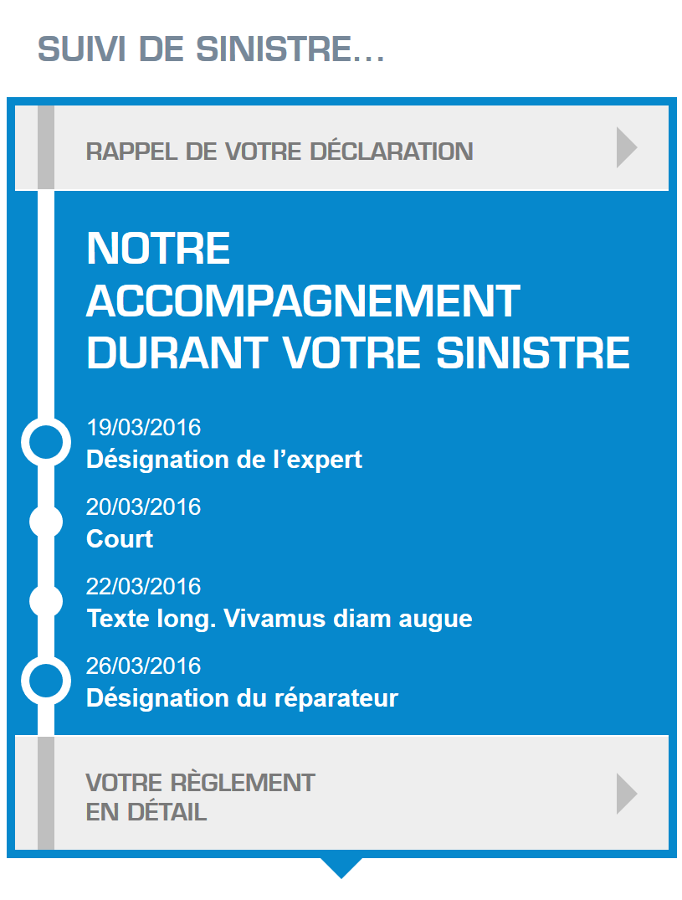
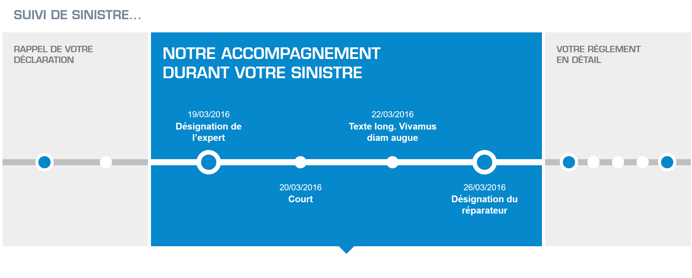
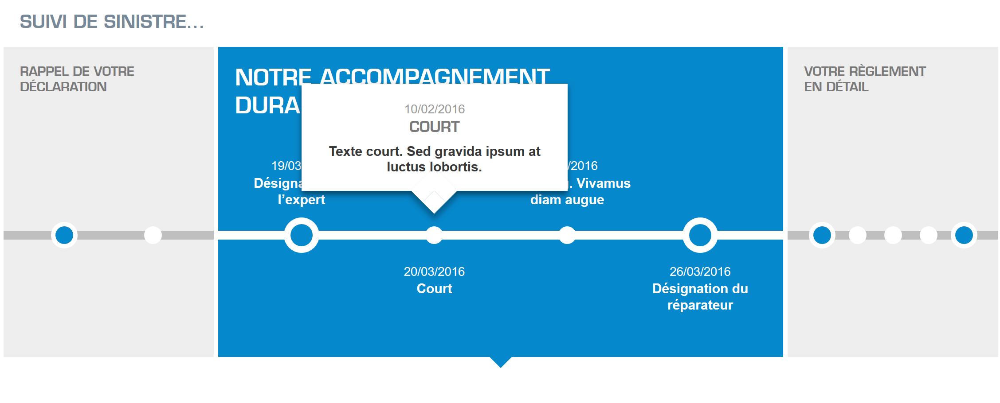

# Test Integrateur for Hubside

## Test the page
Go to https://ralf5543.github.io/test_hubside/

## Installation instructions
Clone the project at https://github.com/ralf5543/test_hubside.git.
Install the dependencies
```
npm install
```
Launch the watcher
```
gulp
```

## Test instructions
> MISSION :
  CrÈer une feuille de style CSS pour habiller le HTML fourni (et obtenir un rendu conforme ‡ la copie d'Ècran ci-jointe)..
  La page doit Ítre compatible tout device et tout navigateur (IE>8).
  L'ensemble doit Ítre responsive avec largeur variable (mise ne forme Èlastique) avec un palier ‡ 768px pour la vue mobile.
  Pas de JS ni de flexbox ni de modification du HTML fourni !
  
>  BONUS : GÈrer en CSS l'affichage des "time-bubble" en roll-over sur le lien.
  La position (haute ou basse) de la bubble dÈpend de la position du texte par rapport au point. Si le texte est en dessous du point la bubble doit s'afficher au dessus (et inversement).
  
    
  
   
   
  